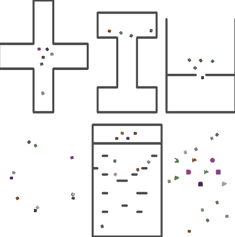

# rl-collision-avoidance

기존 논문을 [Towards Optimally Decentralized Multi-Robot Collision Avoidance via Deep Reinforcement Learning](https://arxiv.org/abs/1709.10082) 구현한 pytorch 프로젝트 (https://github.com/Acmece/rl-collision-avoidance) 를 수정해서 활용한 코드입니다. 더 많은 정보는 위 링크에서 찾으실 수 있습니다.

 Stage1 training    Stage2 training   Circle test   East Asia test   Northern East Asia test01   Northern East Asia test02   Northern East Asia test03   Northern East Asia test04   
:-------------------------:|:-------------------------:

## Docker Container Image

- https://hub.docker.com/r/hyunsung1264/collision-avoid-rl-ubuntu16.04-python2.7-pytorch_cpu
	- > ubuntu 16.04
	- > pytorch 1.5.0+cpu
	- > Intel Xeon Gold 6330


## Requirement

- python2.7
- [ROS Kinetic](http://wiki.ros.org/kinetic)
- [mpi4py](https://mpi4py.readthedocs.io/en/stable/)
- [Stage](http://rtv.github.io/Stage/)
- [PyTorch](http://pytorch.org/)


## How to Simulate


Please use the `stage_ros-add_pose_and_crash` package instead of the default package provided by ROS.
```
mkdir -p catkin_ws/src
cp stage_ros-add_pose_and_crash catkin_ws/src
cd catkin_ws
catkin_make
source devel/setup.bash
```
To use GUI on Windows
Install VcXsrv
and export display address from docker container terminal
```
export DISPLAY=xxx.xxx.xx.xxx:0.0
```

To simulate `circle_test.py`, run the following command:

First Initialize the stage
```
rosrun stage_ros_add_pose_and_crash stageros worlds/circle.world
```
Then run the python code
```
mpiexec -allow-run-as-root -np 50 python circle_test.py
```
To simulate `east_asia_test.py`, run the following command:

First Initialize the stage
```
rosrun stage_ros_add_pose_and_crash stageros worlds/north_east_asia.world
```
Then run the python code
```
mpiexec -allow-run-as-root -np 16 python east_asia_test.py
```

